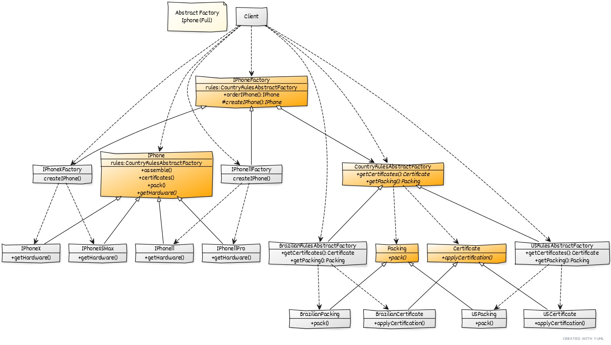

#  Design Patterns Creational

* Abstract Factory
* Builder
* Enums
* Factory
* Prototype
* Singleton

### Abstract Factory

Prover uma interface para criar uma família de objetos relacionados ou dependentes sem especificar suas classes concretas.

 * Ter uma interface principal com os métodos que devem ser implementados (CountryRulesAbstractFactory)
 * Essa interface deve ser implementada pelas classes concretas BrazilianRulesAF e USRulesAF
 * Ter uma classe abstrata com o corpo da implementação (IPhoneFactory)
 * Ter classes concretas estendendo dessa classe abstrata
    * Instanciar uma das classes concretas que implementam a interface (ex: BrazilianRulesAF)
    * Instanciar uma das classes concretas que estendem a classe abstrata, passando a classe 
    que implementa a interface como parâmetro
    * Chamar os metodos desejados
  
 

#
### Builder

#
### Enums

#
### Factory

#
### Prototype

#
### Singleton